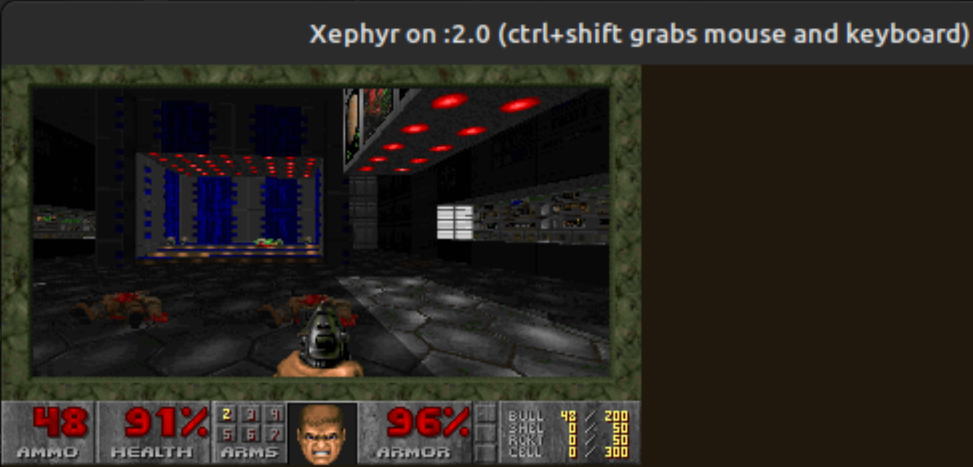

# Original DOOM

## 🕹️ Overview

This repository contains a fork of the original Doom source code, updated with the necessary modifications to compile and run on modern 64-bit Linux systems. The goal is to preserve the classic gameplay experience while ensuring compatibility with contemporary development environments.

## 📋 Requirements

- Linux Mint 21.3 | Codename: virginia | Kernel: 5.15.0-139-generic
- gcc 11.4.0

## 🛠️ Compiling and Running

1. Download the Doom WAD data file from [here](https://mega.nz/file/wkZGCTBY#_4vEgD5mRkE-ZfC7Czx3bSrgGc3K01iE-CMFz_NeDeM) (Doom Ultimate). Save it to a directory of your choice. For this example, the directory will be "~/downloads".
2. Fire up a terminal (make sure the current working directory is "~/downloads") and run the following commands:
```bash
hardrive@cinnamon:~/downloads$ sudo apt update
hardrive@cinnamon:~/downloads$ sudo apt install -y build-essential libx11-dev libxext-dev

hardrive@cinnamon:~/downloads$ mkdir wad
hardrive@cinnamon:~/downloads$ tar -xf doomu.tar.xz -C wad/
hardrive@cinnamon:~/downloads$ export DOOMWADDIR=/home/hardrive/downloads/wad

hardrive@cinnamon:~/downloads$ git clone https://github.com/hardrive9000/DOOM.git

hardrive@cinnamon:~/downloads$ cd DOOM/linuxdoom-1.10/
hardrive@cinnamon:~/downloads/DOOM/linuxdoom-1.10$ mkdir linux
hardrive@cinnamon:~/downloads/DOOM/linuxdoom-1.10$ make

hardrive@cinnamon:~/downloads/DOOM/linuxdoom-1.10$ Xephyr :2 -ac -screen 640x480x8 &
hardrive@cinnamon:~/downloads/DOOM/linuxdoom-1.10$ DISPLAY=:2
hardrive@cinnamon:~/downloads/DOOM/linuxdoom-1.10$ ./linux/linuxxdoom
```

3. Enjoy!

## 🎮 Screenshots


